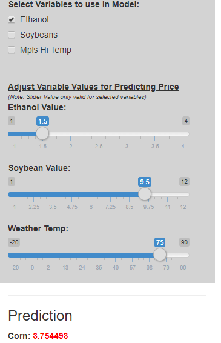
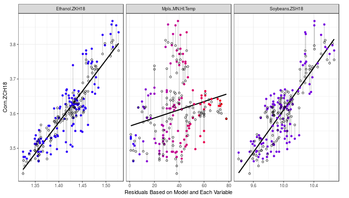

```{r setup, include=FALSE}
knitr::opts_chunk$set(echo = FALSE)
```

## Introduction

Coursera Data Product assignment 4 requires the students to write a shiny application which must perform a calculation based on input from a user.  

The idea for the application came from the work of a colleague who performed data analysis on the quantitative assessment of the factors that may affect the futures levels of Corn.  The application will allow a user to dynamically select the variables to be used in the model.  Based on the variables selected, a series of plots and linear regression information will be displayed.  The user will also be allowed to predict the price of corn based on each variable's value, which can be dynamically changed.

The purpose of the application is to demonstrate the ability to simulate models and how they are affected by the features selected.

**Jenifer Zinsmaster** is credited with the corn statistical analysis.

## Application Features

<div class="columns-2">
<span style="height:100px">

</span>

* Select the Variables to be used in the model
    + Residule Plots to the right will be shown for each variable.
    + The Regression Model output will be displayed below the plots.
* Adjust the Variable Values
    + Only selected variable values will be used in the calculatons
    + The Corn prediction value will be displayed below the options window

</div>

## Residual Plots Displayed




## Shiny Scripts and Application

### UI and Server Code

The shiny scripts may be found on GitHub at: <https://github.com/MarkSpoto/CornAnalysis>

### Shiny Application

The Corn Statistical Modeler can be found on shinyio at: <https://markspoto.shinyapps.io/CornAnalysis/>
